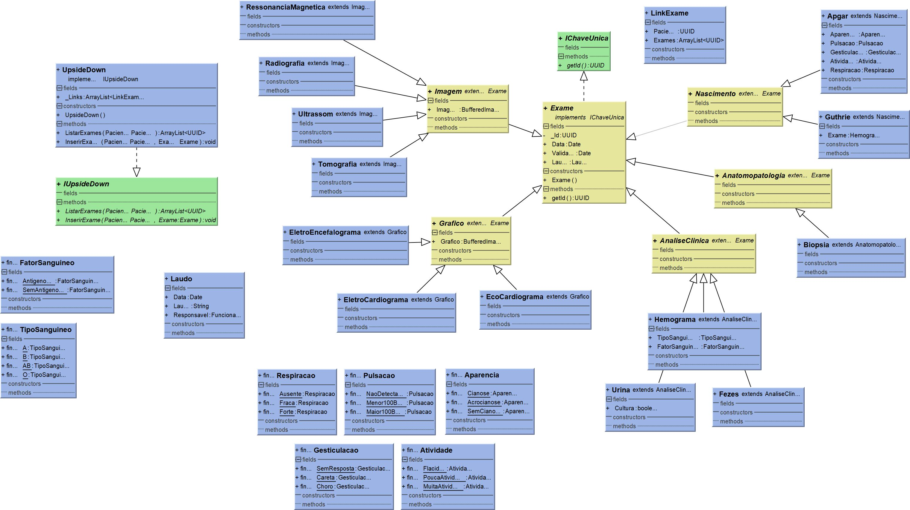

# Software para guarda de histórico médico que permite anonimização

**Medical history storage software that allows anonymization. UFABC 2Q/2019 - Database Class.**

Universidade Federal do ABC - Bacharelado em Ciência da Computação  
programação orientada a objetos 2019/Q2  

  
Diagrama parcial do projeto

## Objetivo

O objetivo do projeto é criar um sistema de guarda de registros médicos que permita utilizar os dados dos exames em algoritmos de aprendizado de máquina sem ferir a privacidade do paciente. O projeto quando disparado inicia uma API REST no endereço local com uma série de métodos de consulta e inserção, os métodos de consulta são pessoas, medicos, atendimentos, exames e upsidedown. Os métodos criaratendimento, fazertriagem e fazerconsulta são de inserção.

## [Abrir o texto completo](./docs/RelatoriodoProjeto-Siloam.pdf)
